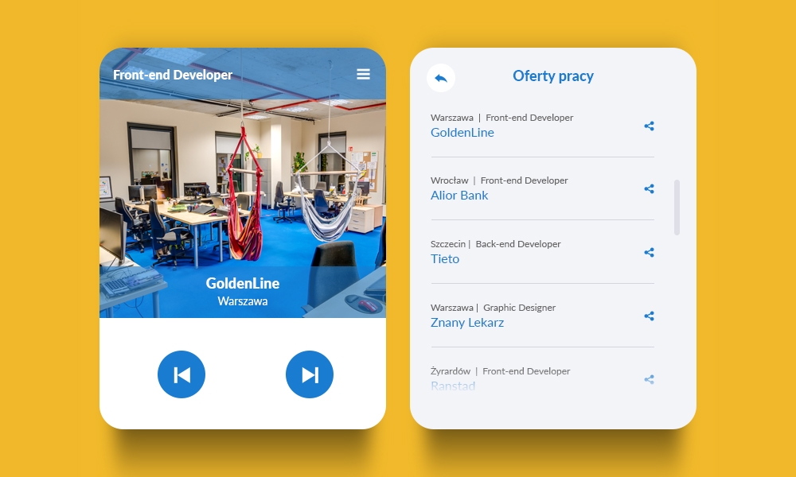

## Front-end Developer @ GoldenLine

Cześć!

Dzięki za dołączenie do rekrutacji na stanowisko Front-end Developer. Mamy dla Ciebie zadanie, które jest pierwszym etapem rekrutacji :)

Powyższe zdjęcie przedstawia widok widgetu z ofertami pracy, który chcielibyśmy zamieścić na stronie głównej serwisu. Niestety developer, któremu zleciliśmy wykonanie zadania zostawił straszny bałagan. Twoim zadaniem jest sprawienie, żeby widget zaczął poprawnie działać poprzez naprawę, optymalizację i uporządkowanie istniejącego kodu. Możesz zrobić wszystko co tylko przyjdzie Ci do głowy, pamiętaj jednak, że:

- ekran początkowy to widok pierwszego ogłoszenia z listy
- po kliknięciu w ikonkę `hamburgera`, użytkownik powinien zobaczyć listę ogłoszeń
- po kliknięciu przycisku `powrotu` na liście ogłoszeń, użytkownik powienien powrócić do głównego widoku
- po wybraniu elementu z listy, użytkownik powinien zostać przeniesiony do widoku głównego i zobaczyć dane oraz zdjęcie ogłoszenia, które wybrał
- po kliknięciu przycisku `następny` lub `poprzedni` na ekranie startowym, użytkownik powinien zobaczyć kolejną/poprzednią ofertę z listy
- po kliknięciu przycisku `udostępniania` na liście ogłoszeń, w konsoli powinno zostać wypisane stanowisko oraz lokalizacja wybranego ogłoszenia

Wymagania:

- obsługujemy ponad 2.7 mln użytkowników, którzy korzystają z obszernego wachlarza przeglądarek i urządzeń dlatego widget musi wyglądać i działać poprawnie absolutnie **WSZĘDZIE**
- żyjemy w zgodzie z Google i **chcemy aby ogłoszenia się dobrze pozycjonowały w SERP'ach** umożliwiając dotarcie do jak największej ilości kandydatów

Sugestie:

- jesteśmy purystami - porządek w kodzie to podstawa
- nie lubimy długo czekać na załadowanie się strony
- uwielbiamy ES6

Powodzenia!
